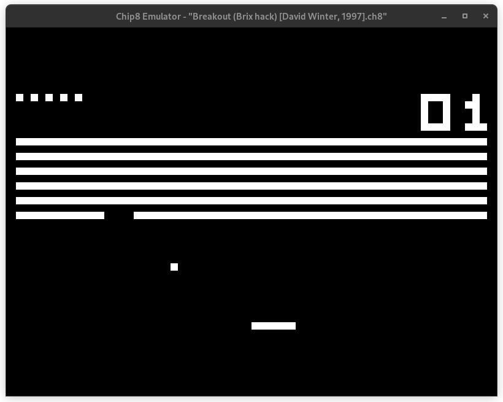

# Chip8 Emulator

An implementation of the [Chip8](https://en.wikipedia.org/wiki/CHIP-8) interpreter by Joseph Weisbecker in Rust.

  

## ROMs

This project only contains the emulator, and not any ROMs to run on it. Many interesting Chip8 ROMs can be found [here](https://github.com/kripod/chip8-roms).

## Keypad mapping

**On the original Chip8**

|     |     |     |     |
| --- | --- | --- | --- |
| 1   | 2   | 3   | C   |
| 4   | 5   | 6   | D   |
| 7   | 8   | 9   | E   |
| A   | 0   | B   | F   |

**On keyboard**

|     |     |     |     |
| --- | --- | --- | --- |
| 1   | 2   | 3   | 4   |
| Q   | W   | E   | R   |
| A   | S   | D   | F   |
| Z   | X   | C   | V   |
